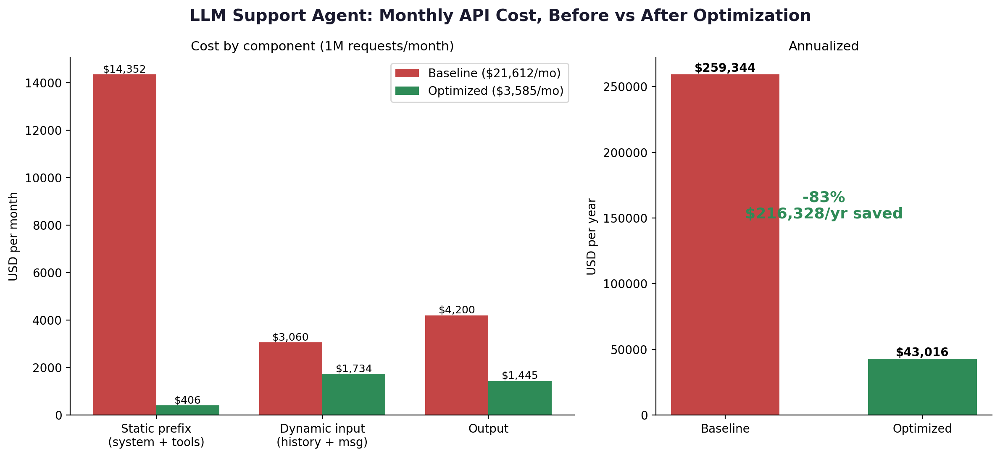

# LLM Token Cost Audit & Optimization Framework

Audits an LLM agent configuration (system prompt + tool schemas + traffic profile), applies five optimization levers, and quantifies the savings in dollars at enterprise scale.

**Demo result:** a realistic customer support agent at 1M requests/month goes from **$21,612/mo to $3,585/mo (-83%, ~$216K/yr)** with zero policy content removed.



## The five levers

| Lever | What it does | Why it pays |
|---|---|---|
| System prompt compression | Prose policies → dense tables/rules | Static prefix is re-sent on every request |
| Tool schema trimming | Descriptions state what/when; policy lives once in the prompt | Schemas are also re-sent every request |
| Prompt caching | `cache_control` on the static prefix | Cache reads bill at 10% of input rate |
| Model routing | Simple intents → Haiku, complex → Sonnet | 3x price gap between tiers |
| Output discipline | Length caps, no mandated boilerplate | Output tokens cost 5x input |

## Run it

```bash
pip install -r requirements.txt
python audit.py examples/support_agent
```

Outputs `output/audit_report.md` and `output/cost_chart.png`.

## Audit your own agent

Copy `examples/support_agent/`, drop in your `baseline/` and `optimized/` configs plus a `traffic_profile.json`, and run.

## Honest caveats

- Token counts use tiktoken (or a regex heuristic offline) as a proxy; production audits should use Anthropic's `count_tokens` endpoint. Before/after deltas are robust to the counter choice.
- Routing shares and cache hit rate are assumptions — validate against real transcripts.
- Compression must ship behind an eval suite proving task success didn't regress. Cheap tokens that give wrong answers are the most expensive tokens of all.

Pricing verified against Anthropic's published rates, July 2026.
